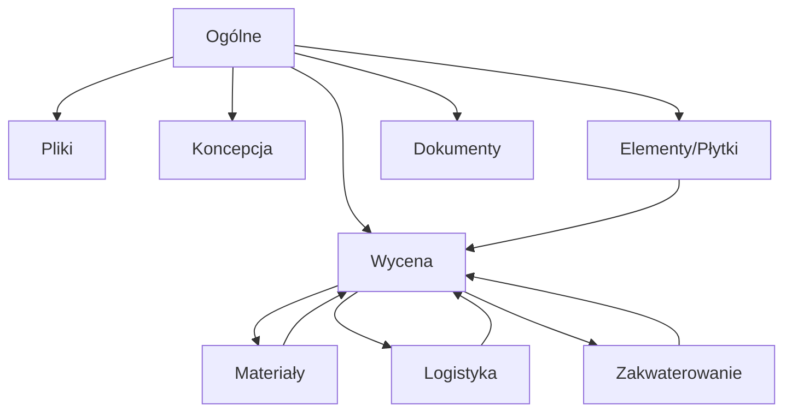

# 📋 FabManage-Clean – Kompleksowy Dokument Projektowy

## _System Zarządzania Projektami Produkcyjnymi dla Scenografii i Dekoracji_

---

## 🎯 **1. OPIS PROJEKTU I CELE STRATEGICZNE**

### **Wizja Projektu**

FabManage-Clean to nowoczesna platforma zarządzania projektami produkcyjnymi specjalnie zaprojektowana dla branży scenograficznej i dekoracyjnej. System umożliwia kompleksowe zarządzanie cyklem życia projektu od koncepcji po finalną realizację, z naciskiem na elastyczność, real-time monitoring oraz precyzyjną kontrolę kosztów.

### **Kluczowe Cele Biznesowe**

- **Modularność**: Dynamiczna aktywacja modułów projektów w zależności od potrzeb
- **Elastyczność**: Konfigurowanie workflow'ów w trakcie realizacji projektu
- **Transparentność**: Live-przeliczenia wycen i real-time tracking postępu
- **Współpraca**: Zespołowa komunikacja i timeline aktywności
- **Kontrola Kosztów**: Precyzyjne zarządzanie BOM, logistyką i zakwaterowaniem
- **Integracja**: Łączenie z zewnętrznymi systemami (CAD/Speckle, Booking API)

### **Grupa Docelowa**

- **Producent scenograficzny** - zarządzanie wieloma projektami jednocześnie
- **Dekorator** - planowanie i realizacja projektów dekoracyjnych
- **Kierownik produkcji** - kontrola kosztów i harmonogramów
- **Zespół projektowy** - współpraca nad szczegółami technicznymi
- **Klient** - monitoring postępu i zatwierdzanie etapów

---

## 🏗️ **2. ARCHITEKTURA SYSTEMU**

### **2.1 Stack Technologiczny**

#### **Frontend**

```typescript
// Główne technologie
const techStack = {
  framework: "React 18 + TypeScript",
  buildTool: "Vite",
  ui: "Ant Design + Custom Design System",
  stateManagement: "Zustand + TanStack Query",
  styling: "Design Tokens z Figma",
  testing: "Vitest + Playwright + Testing Library",
  deployment: "Docker + PWA",
};
```

#### **Backend & Infrastruktura**

```yaml
Database: Supabase PostgreSQL
Authentication: Supabase Auth + RLS
Real-time: Supabase Realtime
Storage: Supabase Storage
API: REST + GraphQL (opcjonalnie)
Deployment: Docker + Kubernetes
Monitoring: Custom + Supabase Analytics
```

### **2.2 Architektura Komponentowa**

#### **Atomic Design Structure**

```
src/
├── new-ui/
│   ├── atoms/           # Button, Input, Badge, Icon
│   ├── molecules/       # SearchBox, FormField, StatusCard
│   ├── organisms/       # DataTable, KanbanBoard, Drawer
│   ├── templates/       # ProjectLayout, ModuleLayout
│   └── pages/          # ProjectDetails, Materials, etc.
├── design-system/
│   ├── tokens/         # Design tokens z Figma
│   ├── components/     # Reusable components
│   └── utils/         # Helper functions
└── schemas/           # Zod validation schemas
```

#### **State Management Architecture**

```typescript
// Zustand stores per domena
interface StateArchitecture {
  projects: ProjectStore; // Główne dane projektów
  materials: MaterialStore; // Materiały i BOM
  tiles: TileStore; // Elementy projektu (Kanban)
  logistics: LogisticsStore; // Logistyka i transport
  accommodation: AccommodationStore; // Zakwaterowanie
  pricing: PricingStore; // Wyceny i kalkulacje
  ui: UIStore; // Stan interfejsu
  auth: AuthStore; // Autoryzacja
}
```

---

## 📊 **3. MODUŁY PROJEKTU I ZALEŻNOŚCI**

### **3.1 Mapa Modułów i Zależności**



### **3.2 Szczegółowy Opis Modułów**

#### **🎯 Moduł "Ogólne"** _(Core Module)_

**Funkcjonalność:**

- Metadane projektu (nazwa, klient, budżet, daty)
- Formularz edycji podstawowych informacji
- Komentarze zespołu z real-time updates
- Timeline aktywności projektu
- Konfiguracja aktywnych modułów

**Zależności Backend:**

```sql
-- Główne tabele
projects (id, name, client_id, status, budget, modules, created_at, updated_at)
project_messages (id, project_id, author_id, body_html, created_at)
project_activity (id, project_id, type, payload_json, actor_id, created_at)
project_modules (id, project_id, module_name, is_active, configuration)
```

**Komponenty UI:**

- `ProjectHeader` - podstawowe informacje
- `ProjectMessages` - lista komentarzy z composer
- `ProjectTimeline` - historia aktywności
- `ModuleConfig` - konfiguracja modułów

---

#### **📁 Moduł "Pliki"**

**Funkcjonalność:**

- Hierarchiczna struktura katalogów projektu
- Upload/download plików z drag&drop
- Wersjonowanie plików
- Podgląd plików (obrazy, PDF)
- Współdzielenie plików z zespołem

**Zależności Backend:**

```sql
folders (id, project_id, parent_id, name, path, created_at)
files (id, folder_id, name, size, type, url, version, created_at, updated_at)
file_permissions (id, file_id, user_id, permission_type)
```

**Komponenty UI:**

- `FileExplorer` - drzewo katalogów
- `FileUploader` - drag&drop upload
- `FilePreview` - podgląd plików
- `FileVersioning` - historia wersji

---

#### **🎨 Moduł "Koncepcja"**

**Funkcjonalność:**

- Opis koncepcji projektu
- Mockupy i wizualizacje
- Dokumenty projektowe
- Zatwierdzanie koncepcji przez klienta

**Zależności Backend:**

```sql
concepts (id, project_id, title, description, status, created_at, updated_at)
concept_assets (id, concept_id, type, url, metadata, created_at)
concept_approvals (id, concept_id, approver_id, status, comments, created_at)
```

**Komponenty UI:**

- `ConceptEditor` - edycja koncepcji
- `AssetGallery` - galeria mockupów
- `ApprovalWorkflow` - proces zatwierdzania

---

#### **💰 Moduł "Wycena"** _(Agregator Kosztów)_

**Funkcjonalność:**

- Live-przeliczenia kosztów z wszystkich modułów
- Agregacja BOM, logistyki, zakwaterowania
- Narzuty i marże
- Porównanie z budżetem projektu
- Eksport wycen do PDF

**Zależności Backend:**

```sql
project_pricing (id, project_id, total_cost, material_cost, logistics_cost,
                accommodation_cost, markup, created_at, updated_at)
pricing_breakdown (id, project_id, category, amount, details, created_at)
```

**Komponenty UI:**

- `PricingDashboard` - główny panel wycen
- `CostBreakdown` - szczegółowy podział kosztów
- `BudgetComparison` - porównanie z budżetem
- `PricingExport` - eksport do PDF

---

#### **🧩 Moduł "Elementy/Płytki"** _(Kanban)_

**Funkcjonalność:**

- Kafelkowy widok elementów projektu
- Kanban board z statusami
- Drag&drop między kolumnami
- Terminy i priorytety
- Drawer edycji elementu

**Zależności Backend:**

```sql
tiles (id, project_id, name, description, status, priority, deadline,
       assignee_id, created_at, updated_at)
kanban_columns (id, project_id, name, order, color, created_at)
kanban_cards (id, tile_id, column_id, position, created_at)
tile_dependencies (id, tile_id, depends_on_tile_id)
```

**Komponenty UI:**

- `TileGrid` - kafelkowy widok
- `KanbanBoard` - tablica Kanban
- `TileDrawer` - edycja elementu
- `DependencyGraph` - graf zależności

---

#### **📦 Moduł "Materiały"**

**Funkcjonalność:**

- Pozycje BOM (Bill of Materials)
- Stan magazynowy materiałów
- Zamówienia materiałów
- Tracking dostaw
- Integracja z wyceną

**Zależności Backend:**

```sql
materials (id, code, name, category, unit_price, inventory_level,
           supplier_id, created_at, updated_at)
bom_items (id, project_id, material_id, quantity, unit_cost,
           total_cost, created_at, updated_at)
material_orders (id, project_id, material_id, quantity, status,
                 order_date, delivery_date, created_at)
inventory_movements (id, material_id, type, quantity, reason, created_at)
```

**Komponenty UI:**

- `BOMTable` - tabela BOM z virtualizacją
- `MaterialDrawer` - CRUD pozycji BOM
- `InventoryPanel` - stan magazynowy
- `OrderTracking` - śledzenie zamówień

---

#### **📄 Moduł "Dokumenty"**

**Funkcjonalność:**

- Faktury i dokumenty finansowe
- Umowy i dokumenty prawne
- Certyfikaty i dokumentacja techniczna
- Kategoryzacja dokumentów
- Eksport i archiwizacja

**Zależności Backend:**

```sql
documents (id, project_id, type, category, title, url, metadata,
           created_at, updated_at)
document_categories (id, name, description, color, created_at)
```

**Komponenty UI:**

- `DocumentLibrary` - biblioteka dokumentów
- `DocumentUploader` - upload dokumentów
- `DocumentViewer` - podgląd dokumentów
- `DocumentExport` - eksport dokumentów

---

#### **🚚 Moduł "Logistyka"**

**Funkcjonalność:**

- Zamawianie floty transportowej
- Kalkulacja kosztów transportu
- Tracking dostaw
- Optymalizacja tras
- Live-aktualizacja w wycenie

**Zależności Backend:**

```sql
logistics_orders (id, project_id, vehicle_type, quantity, cost_per_unit,
                  total_cost, pickup_date, delivery_date, status, created_at)
transport_routes (id, logistics_order_id, origin, destination, distance,
                  estimated_time, created_at)
```

**Komponenty UI:**

- `LogisticsDashboard` - panel logistyczny
- `RouteOptimizer` - optymalizacja tras
- `DeliveryTracking` - śledzenie dostaw
- `CostCalculator` - kalkulator kosztów

---

#### **🏨 Moduł "Zakwaterowanie"**

**Funkcjonalność:**

- Rezerwacje hoteli i noclegów
- Zarządzanie wyżywieniem
- Katalog partnerów
- Integracja z Booking API
- Kalkulacja kosztów zakwaterowania

**Zależności Backend:**

```sql
accommodation_bookings (id, project_id, hotel_id, check_in, check_out,
                        guests, cost_per_night, total_cost, status, created_at)
accommodation_partners (id, name, type, location, contact_info,
                        rating, created_at)
meal_orders (id, accommodation_booking_id, meal_type, quantity,
             cost_per_meal, total_cost, created_at)
```

**Komponenty UI:**

- `AccommodationCalendar` - kalendarz rezerwacji
- `PartnerCatalog` - katalog partnerów
- `BookingManager` - zarządzanie rezerwacjami
- `CostBreakdown` - podział kosztów

---

## 🗄️ **4. SZCZEGÓŁOWY SCHEMAT BAZY DANYCH**

### **4.1 Główne Tabele Systemu**

```sql
-- ==============================================
-- CORE PROJECT TABLES
-- ==============================================

-- Projekty (główna tabela)
CREATE TABLE projects (
    id UUID PRIMARY KEY DEFAULT gen_random_uuid(),
    name VARCHAR(255) NOT NULL,
    client_id UUID REFERENCES clients(id),
    status VARCHAR(50) DEFAULT 'active',
    budget DECIMAL(12,2),
    start_date DATE,
    end_date DATE,
    modules JSONB DEFAULT '{}', -- Konfiguracja aktywnych modułów
    created_at TIMESTAMP WITH TIME ZONE DEFAULT NOW(),
    updated_at TIMESTAMP WITH TIME ZONE DEFAULT NOW(),
    created_by UUID REFERENCES auth.users(id)
);

-- Wiadomości projektu
CREATE TABLE project_messages (
    id UUID PRIMARY KEY DEFAULT gen_random_uuid(),
    project_id UUID REFERENCES projects(id) ON DELETE CASCADE,
    author_id UUID REFERENCES auth.users(id),
    body_html TEXT NOT NULL,
    created_at TIMESTAMP WITH TIME ZONE DEFAULT NOW(),
    updated_at TIMESTAMP WITH TIME ZONE DEFAULT NOW()
);

-- Aktywność projektu (timeline)
CREATE TABLE project_activity (
    id UUID PRIMARY KEY DEFAULT gen_random_uuid(),
    project_id UUID REFERENCES projects(id) ON DELETE CASCADE,
    type VARCHAR(100) NOT NULL, -- 'message', 'status_change', 'file_upload', etc.
    payload_json JSONB,
    actor_id UUID REFERENCES auth.users(id),
    created_at TIMESTAMP WITH TIME ZONE DEFAULT NOW()
);

-- ==============================================
-- FILES MODULE
-- ==============================================

-- Katalogi plików
CREATE TABLE folders (
    id UUID PRIMARY KEY DEFAULT gen_random_uuid(),
    project_id UUID REFERENCES projects(id) ON DELETE CASCADE,
    parent_id UUID REFERENCES folders(id),
    name VARCHAR(255) NOT NULL,
    path TEXT NOT NULL,
    created_at TIMESTAMP WITH TIME ZONE DEFAULT NOW(),
    created_by UUID REFERENCES auth.users(id)
);

-- Pliki
CREATE TABLE files (
    id UUID PRIMARY KEY DEFAULT gen_random_uuid(),
    folder_id UUID REFERENCES folders(id) ON DELETE CASCADE,
    name VARCHAR(255) NOT NULL,
    size BIGINT NOT NULL,
    type VARCHAR(100),
    url TEXT NOT NULL,
    version INTEGER DEFAULT 1,
    created_at TIMESTAMP WITH TIME ZONE DEFAULT NOW(),
    updated_at TIMESTAMP WITH TIME ZONE DEFAULT NOW(),
    created_by UUID REFERENCES auth.users(id)
);

-- ==============================================
-- CONCEPT MODULE
-- ==============================================

-- Koncepcje projektów
CREATE TABLE concepts (
    id UUID PRIMARY KEY DEFAULT gen_random_uuid(),
    project_id UUID REFERENCES projects(id) ON DELETE CASCADE,
    title VARCHAR(255) NOT NULL,
    description TEXT,
    status VARCHAR(50) DEFAULT 'draft',
    created_at TIMESTAMP WITH TIME ZONE DEFAULT NOW(),
    updated_at TIMESTAMP WITH TIME ZONE DEFAULT NOW()
);

-- Zasoby koncepcji (mockupy, wizualizacje)
CREATE TABLE concept_assets (
    id UUID PRIMARY KEY DEFAULT gen_random_uuid(),
    concept_id UUID REFERENCES concepts(id) ON DELETE CASCADE,
    type VARCHAR(100) NOT NULL, -- 'mockup', 'visualization', 'document'
    url TEXT NOT NULL,
    metadata JSONB,
    created_at TIMESTAMP WITH TIME ZONE DEFAULT NOW()
);

-- ==============================================
-- MATERIALS MODULE
-- ==============================================

-- Materiały
CREATE TABLE materials (
    id UUID PRIMARY KEY DEFAULT gen_random_uuid(),
    code VARCHAR(100) UNIQUE NOT NULL,
    name VARCHAR(255) NOT NULL,
    category VARCHAR(100),
    unit_price DECIMAL(10,2),
    inventory_level INTEGER DEFAULT 0,
    supplier_id UUID REFERENCES suppliers(id),
    created_at TIMESTAMP WITH TIME ZONE DEFAULT NOW(),
    updated_at TIMESTAMP WITH TIME ZONE DEFAULT NOW()
);

-- Pozycje BOM
CREATE TABLE bom_items (
    id UUID PRIMARY KEY DEFAULT gen_random_uuid(),
    project_id UUID REFERENCES projects(id) ON DELETE CASCADE,
    material_id UUID REFERENCES materials(id),
    quantity DECIMAL(10,3) NOT NULL,
    unit_cost DECIMAL(10,2),
    total_cost DECIMAL(12,2),
    created_at TIMESTAMP WITH TIME ZONE DEFAULT NOW(),
    updated_at TIMESTAMP WITH TIME ZONE DEFAULT NOW()
);

-- Zamówienia materiałów
CREATE TABLE material_orders (
    id UUID PRIMARY KEY DEFAULT gen_random_uuid(),
    project_id UUID REFERENCES projects(id) ON DELETE CASCADE,
    material_id UUID REFERENCES materials(id),
    quantity DECIMAL(10,3) NOT NULL,
    status VARCHAR(50) DEFAULT 'pending',
    order_date DATE,
    delivery_date DATE,
    created_at TIMESTAMP WITH TIME ZONE DEFAULT NOW()
);

-- ==============================================
-- TILES/KANBAN MODULE
-- ==============================================

-- Elementy projektu (płytki)
CREATE TABLE tiles (
    id UUID PRIMARY KEY DEFAULT gen_random_uuid(),
    project_id UUID REFERENCES projects(id) ON DELETE CASCADE,
    name VARCHAR(255) NOT NULL,
    description TEXT,
    status VARCHAR(50) DEFAULT 'todo',
    priority VARCHAR(20) DEFAULT 'medium',
    deadline DATE,
    assignee_id UUID REFERENCES auth.users(id),
    created_at TIMESTAMP WITH TIME ZONE DEFAULT NOW(),
    updated_at TIMESTAMP WITH TIME ZONE DEFAULT NOW()
);

-- Kolumny Kanban
CREATE TABLE kanban_columns (
    id UUID PRIMARY KEY DEFAULT gen_random_uuid(),
    project_id UUID REFERENCES projects(id) ON DELETE CASCADE,
    name VARCHAR(100) NOT NULL,
    order_index INTEGER NOT NULL,
    color VARCHAR(7),
    created_at TIMESTAMP WITH TIME ZONE DEFAULT NOW()
);

-- Karty Kanban
CREATE TABLE kanban_cards (
    id UUID PRIMARY KEY DEFAULT gen_random_uuid(),
    tile_id UUID REFERENCES tiles(id) ON DELETE CASCADE,
    column_id UUID REFERENCES kanban_columns(id),
    position INTEGER NOT NULL,
    created_at TIMESTAMP WITH TIME ZONE DEFAULT NOW()
);

-- ==============================================
-- LOGISTICS MODULE
-- ==============================================

-- Zamówienia logistyczne
CREATE TABLE logistics_orders (
    id UUID PRIMARY KEY DEFAULT gen_random_uuid(),
    project_id UUID REFERENCES projects(id) ON DELETE CASCADE,
    vehicle_type VARCHAR(100) NOT NULL,
    quantity INTEGER DEFAULT 1,
    cost_per_unit DECIMAL(10,2),
    total_cost DECIMAL(12,2),
    pickup_date DATE,
    delivery_date DATE,
    status VARCHAR(50) DEFAULT 'pending',
    created_at TIMESTAMP WITH TIME ZONE DEFAULT NOW()
);

-- Trasy transportowe
CREATE TABLE transport_routes (
    id UUID PRIMARY KEY DEFAULT gen_random_uuid(),
    logistics_order_id UUID REFERENCES logistics_orders(id) ON DELETE CASCADE,
    origin VARCHAR(255) NOT NULL,
    destination VARCHAR(255) NOT NULL,
    distance DECIMAL(8,2),
    estimated_time INTEGER, -- w minutach
    created_at TIMESTAMP WITH TIME ZONE DEFAULT NOW()
);

-- ==============================================
-- ACCOMMODATION MODULE
-- ==============================================

-- Rezerwacje zakwaterowania
CREATE TABLE accommodation_bookings (
    id UUID PRIMARY KEY DEFAULT gen_random_uuid(),
    project_id UUID REFERENCES projects(id) ON DELETE CASCADE,
    hotel_id UUID REFERENCES accommodation_partners(id),
    check_in DATE NOT NULL,
    check_out DATE NOT NULL,
    guests INTEGER DEFAULT 1,
    cost_per_night DECIMAL(8,2),
    total_cost DECIMAL(10,2),
    status VARCHAR(50) DEFAULT 'pending',
    created_at TIMESTAMP WITH TIME ZONE DEFAULT NOW()
);

-- Partnerzy zakwaterowania
CREATE TABLE accommodation_partners (
    id UUID PRIMARY KEY DEFAULT gen_random_uuid(),
    name VARCHAR(255) NOT NULL,
    type VARCHAR(100), -- 'hotel', 'apartment', 'hostel'
    location VARCHAR(255),
    contact_info JSONB,
    rating DECIMAL(3,2),
    created_at TIMESTAMP WITH TIME ZONE DEFAULT NOW()
);

-- ==============================================
-- PRICING MODULE
-- ==============================================

-- Wyceny projektów
CREATE TABLE project_pricing (
    id UUID PRIMARY KEY DEFAULT gen_random_uuid(),
    project_id UUID REFERENCES projects(id) ON DELETE CASCADE,
    total_cost DECIMAL(12,2),
    material_cost DECIMAL(12,2),
    logistics_cost DECIMAL(12,2),
    accommodation_cost DECIMAL(12,2),
    markup_percentage DECIMAL(5,2),
    markup_amount DECIMAL(12,2),
    created_at TIMESTAMP WITH TIME ZONE DEFAULT NOW(),
    updated_at TIMESTAMP WITH TIME ZONE DEFAULT NOW()
);

-- Szczegółowy podział kosztów
CREATE TABLE pricing_breakdown (
    id UUID PRIMARY KEY DEFAULT gen_random_uuid(),
    project_id UUID REFERENCES projects(id) ON DELETE CASCADE,
    category VARCHAR(100) NOT NULL,
    amount DECIMAL(12,2) NOT NULL,
    details JSONB,
    created_at TIMESTAMP WITH TIME ZONE DEFAULT NOW()
);
```

### **4.2 Indeksy i Optymalizacje**

```sql
-- Indeksy dla wydajności
CREATE INDEX idx_projects_client_id ON projects(client_id);
CREATE INDEX idx_projects_status ON projects(status);
CREATE INDEX idx_project_messages_project_id ON project_messages(project_id);
CREATE INDEX idx_project_activity_project_id ON project_activity(project_id);
CREATE INDEX idx_files_folder_id ON files(folder_id);
CREATE INDEX idx_bom_items_project_id ON bom_items(project_id);
CREATE INDEX idx_tiles_project_id ON tiles(project_id);
CREATE INDEX idx_kanban_cards_column_id ON kanban_cards(column_id);

-- Indeksy dla real-time queries
CREATE INDEX idx_project_messages_created_at ON project_messages(created_at DESC);
CREATE INDEX idx_project_activity_created_at ON project_activity(created_at DESC);
CREATE INDEX idx_tiles_status ON tiles(status);
CREATE INDEX idx_logistics_orders_status ON logistics_orders(status);
```

### **4.3 Row Level Security (RLS)**

```sql
-- Włączanie RLS dla wszystkich tabel
ALTER TABLE projects ENABLE ROW LEVEL SECURITY;
ALTER TABLE project_messages ENABLE ROW LEVEL SECURITY;
ALTER TABLE project_activity ENABLE ROW LEVEL SECURITY;
-- ... (dla wszystkich tabel)

-- Polityki RLS - przykład dla projects
CREATE POLICY "Users can view projects they have access to" ON projects
    FOR SELECT USING (
        auth.uid() IN (
            SELECT user_id FROM project_permissions
            WHERE project_id = projects.id
        )
    );

CREATE POLICY "Users can update projects they can edit" ON projects
    FOR UPDATE USING (
        auth.uid() IN (
            SELECT user_id FROM project_permissions
            WHERE project_id = projects.id AND permission = 'edit'
        )
    );
```

---

## 🚀 **5. PLAN IMPLEMENTACJI - ROADMAP**

### **5.1 Faza 1: Foundation & Core (Miesiące 1-3)**

#### **Sprint 1-2: Infrastructure Setup**

- [ ] **Setup Supabase** - konfiguracja bazy danych, RLS, real-time
- [ ] **Database Schema** - implementacja wszystkich tabel z indeksami
- [ ] **Authentication** - setup Supabase Auth z custom claims
- [ ] **Design System** - finalizacja tokenów i komponentów bazowych
- [ ] **Testing Infrastructure** - setup Vitest, Playwright, CI/CD

#### **Sprint 3-4: Core Services & State Management**

- [ ] **API Services** - implementacja wszystkich serwisów CRUD
- [ ] **Zustand Stores** - setup store'ów dla każdego modułu
- [ ] **TanStack Query** - konfiguracja cache i real-time subscriptions
- [ ] **Form Validation** - rozszerzenie schematów Zod
- [ ] **Error Handling** - globalne error boundaries i logging

#### **Sprint 5-6: Project Layout & Navigation**

- [ ] **ProjectLayout** - główny layout z tabami modułów
- [ ] **Module Navigation** - dynamiczne ładowanie modułów
- [ ] **Routing** - lazy loading routes per moduł
- [ ] **Breadcrumbs** - nawigacja w projekcie
- [ ] **Mobile Responsiveness** - responsive design

### **5.2 Faza 2: Core Modules (Miesiące 4-6)**

#### **Sprint 7-8: Moduł "Ogólne"**

- [ ] **ProjectHeader** - podstawowe informacje projektu
- [ ] **ProjectMessages** - lista komentarzy z real-time updates
- [ ] **MessageComposer** - formularz dodawania komentarzy
- [ ] **ProjectTimeline** - historia aktywności z filtrowaniem
- [ ] **ModuleConfig** - konfiguracja aktywnych modułów

#### **Sprint 9-10: Moduł "Elementy/Płytki" (Kanban)**

- [ ] **TileGrid** - kafelkowy widok elementów
- [ ] **KanbanBoard** - tablica Kanban z drag&drop
- [ ] **TileDrawer** - formularz edycji elementu
- [ ] **DependencyGraph** - graf zależności między elementami
- [ ] **Real-time Updates** - live updates statusów

#### **Sprint 11-12: Moduł "Materiały"**

- [ ] **BOMTable** - tabela BOM z virtualizacją
- [ ] **MaterialDrawer** - CRUD pozycji BOM
- [ ] **InventoryPanel** - stan magazynowy
- [ ] **OrderTracking** - śledzenie zamówień
- [ ] **Integration z Wyceną** - live updates kosztów

### **5.3 Faza 3: Advanced Modules (Miesiące 7-9)**

#### **Sprint 13-14: Moduł "Wycena"**

- [ ] **PricingDashboard** - główny panel wycen
- [ ] **CostBreakdown** - szczegółowy podział kosztów
- [ ] **BudgetComparison** - porównanie z budżetem
- [ ] **Live Calculations** - real-time przeliczenia
- [ ] **PricingExport** - eksport do PDF

#### **Sprint 15-16: Moduł "Logistyka"**

- [ ] **LogisticsDashboard** - panel logistyczny
- [ ] **RouteOptimizer** - optymalizacja tras
- [ ] **DeliveryTracking** - śledzenie dostaw
- [ ] **CostCalculator** - kalkulator kosztów
- [ ] **Integration z Wyceną** - live updates

#### **Sprint 17-18: Moduł "Zakwaterowanie"**

- [ ] **AccommodationCalendar** - kalendarz rezerwacji
- [ ] **PartnerCatalog** - katalog partnerów
- [ ] **BookingManager** - zarządzanie rezerwacjami
- [ ] **Booking API Integration** - integracja z zewnętrznymi API
- [ ] **Cost Management** - zarządzanie kosztami

### **5.4 Faza 4: Additional Modules (Miesiące 10-12)**

#### **Sprint 19-20: Moduł "Pliki"**

- [ ] **FileExplorer** - drzewo katalogów
- [ ] **FileUploader** - drag&drop upload
- [ ] **FilePreview** - podgląd plików
- [ ] **FileVersioning** - historia wersji
- [ ] **FileSharing** - współdzielenie plików

#### **Sprint 21-22: Moduł "Koncepcja"**

- [ ] **ConceptEditor** - edycja koncepcji
- [ ] **AssetGallery** - galeria mockupów
- [ ] **ApprovalWorkflow** - proces zatwierdzania
- [ ] **VersionControl** - kontrola wersji koncepcji
- [ ] **ClientApproval** - zatwierdzanie przez klienta

#### **Sprint 23-24: Moduł "Dokumenty"**

- [ ] **DocumentLibrary** - biblioteka dokumentów
- [ ] **DocumentUploader** - upload dokumentów
- [ ] **DocumentViewer** - podgląd dokumentów
- [ ] **DocumentExport** - eksport dokumentów
- [ ] **DocumentArchiving** - archiwizacja

### **5.5 Faza 5: Integration & Polish (Miesiące 13-15)**

#### **Sprint 25-26: Real-time Integration**

- [ ] **Real-time Messaging** - live chat w projekcie
- [ ] **Live Updates** - real-time updates wszystkich modułów
- [ ] **Collaboration Features** - współpraca w czasie rzeczywistym
- [ ] **Notification System** - system powiadomień
- [ ] **Presence Indicators** - wskaźniki obecności

#### **Sprint 27-28: Performance & Optimization**

- [ ] **Performance Optimization** - optymalizacja wydajności
- [ ] **Caching Strategy** - zaawansowane cache'owanie
- [ ] **Bundle Optimization** - optymalizacja bundle'ów
- [ ] **Database Optimization** - optymalizacja zapytań
- [ ] **Memory Management** - zarządzanie pamięcią

#### **Sprint 29-30: Testing & Quality Assurance**

- [ ] **E2E Testing** - kompletne testy end-to-end
- [ ] **Performance Testing** - testy wydajności
- [ ] **Security Testing** - testy bezpieczeństwa
- [ ] **Accessibility Testing** - testy dostępności
- [ ] **User Acceptance Testing** - testy akceptacyjne

---

## 🧪 **6. STRATEGIA TESTOWANIA**

### **6.1 Test Pyramid**

```typescript
// Unit Tests (70%)
describe("MaterialStore", () => {
  test("should add material to BOM", () => {
    const store = createMaterialStore();
    store.addBOMItem({ materialId: "1", quantity: 5 });
    expect(store.bomItems).toHaveLength(1);
  });
});

// Integration Tests (20%)
describe("BOM Integration", () => {
  test("should sync BOM with pricing", async () => {
    const material = await createMaterial();
    const bomItem = await addBOMItem(material.id);
    const pricing = await calculatePricing();
    expect(pricing.materialCost).toBeGreaterThan(0);
  });
});

// E2E Tests (10%)
test("complete project workflow", async ({ page }) => {
  await page.goto("/projects/new");
  await page.fill('[name="name"]', "Test Project");
  await page.click('button:has-text("Create")');

  // Test module activation
  await page.click('[data-module="materials"]');
  await page.click('button:has-text("Add Material")');

  // Test pricing calculation
  await page.click('[data-module="pricing"]');
  await expect(page.locator(".total-cost")).toBeVisible();
});
```

### **6.2 Testing Strategy per Module**

#### **Core Modules Testing**

- **Unit Tests**: Store logic, utility functions, validation schemas
- **Integration Tests**: API integration, real-time subscriptions
- **E2E Tests**: Complete user workflows, cross-module interactions

#### **UI Components Testing**

- **Visual Regression**: Screenshot comparison dla components
- **Accessibility**: WCAG AA compliance testing
- **Responsive**: Multi-device testing
- **Performance**: Component rendering performance

#### **Database Testing**

- **Schema Validation**: Database schema integrity
- **RLS Testing**: Row Level Security policies
- **Performance**: Query performance testing
- **Backup/Recovery**: Disaster recovery testing

---

## 🔒 **7. BEZPIECZEŃSTWO I COMPLIANCE**

### **7.1 Security Measures**

```typescript
// Authentication & Authorization
interface SecurityConfig {
  authentication: {
    provider: "Supabase Auth";
    mfa: boolean;
    sessionTimeout: number;
  };
  authorization: {
    rls: boolean; // Row Level Security
    permissions: PermissionMatrix;
    auditLog: boolean;
  };
  dataProtection: {
    encryption: "AES-256";
    backup: "Encrypted";
    retention: "7 years";
  };
}
```

### **7.2 Compliance Requirements**

- **GDPR**: Data protection i privacy compliance
- **ISO 27001**: Information security management
- **SOC 2**: Security, availability, processing integrity
- **Industry Standards**: Manufacturing industry compliance

---

## 📈 **8. METRYKI SUKCESU I MONITORING**

### **8.1 Business Metrics**

```typescript
interface BusinessMetrics {
  efficiency: {
    projectCompletionTime: "20% reduction";
    costAccuracy: "95% accuracy";
    resourceUtilization: "15% improvement";
  };
  quality: {
    errorRate: "< 0.1%";
    clientSatisfaction: "> 4.5/5";
    reworkRate: "< 5%";
  };
  adoption: {
    userAdoption: "90% within 6 months";
    featureUsage: "80% of modules used";
    trainingTime: "< 2 hours per user";
  };
}
```

### **8.2 Technical Metrics**

```typescript
interface TechnicalMetrics {
  performance: {
    pageLoadTime: "< 2 seconds";
    apiResponseTime: "< 100ms";
    uptime: "99.9%";
  };
  scalability: {
    concurrentUsers: "1000+";
    dataVolume: "10TB+";
    responseTime: "Consistent under load";
  };
  quality: {
    testCoverage: "> 80%";
    bugRate: "< 0.1%";
    securityVulnerabilities: "Zero critical";
  };
}
```

---

## 🎯 **9. DEFINICJA UKOŃCZENIA (DONE)**

### **9.1 Functional Requirements**

- [ ] **Wszystkie moduły** działają zgodnie z specyfikacją
- [ ] **Real-time updates** działają we wszystkich modułach
- [ ] **Live calculations** wycen działają poprawnie
- [ ] **Cross-module integration** jest w pełni funkcjonalna
- [ ] **Mobile responsiveness** na wszystkich urządzeniach

### **9.2 Technical Requirements**

- [ ] **Performance** - wszystkie metryki wydajności spełnione
- [ ] **Security** - wszystkie testy bezpieczeństwa przechodzą
- [ ] **Testing** - 80%+ code coverage, wszystkie E2E testy przechodzą
- [ ] **Accessibility** - WCAG AA compliance
- [ ] **Browser Support** - Chrome, Firefox, Safari, Edge

### **9.3 Business Requirements**

- [ ] **User Acceptance** - wszystkie testy UAT przechodzą
- [ ] **Training Materials** - dokumentacja i materiały szkoleniowe
- [ ] **Support Process** - proces wsparcia technicznego
- [ ] **Deployment** - production deployment successful
- [ ] **Monitoring** - system monitoringu działa poprawnie

---

## 📚 **10. DOKUMENTACJA I ZASOBY**

### **10.1 Technical Documentation**

- **API Documentation** - Swagger/OpenAPI specs
- **Database Schema** - ERD i dokumentacja tabel
- **Component Library** - Storybook documentation
- **Deployment Guide** - Docker i Kubernetes setup
- **Development Guide** - Setup i development workflow

### **10.2 User Documentation**

- **User Manual** - kompletny przewodnik użytkownika
- **Video Tutorials** - nagrania szkoleniowe
- **FAQ** - najczęściej zadawane pytania
- **Support Portal** - portal wsparcia technicznego
- **Release Notes** - notatki o wydaniach

### **10.3 Business Documentation**

- **Business Requirements** - wymagania biznesowe
- **Process Documentation** - dokumentacja procesów
- **Compliance Documentation** - dokumentacja zgodności
- **Training Materials** - materiały szkoleniowe
- **Change Management** - zarządzanie zmianami

---

## 🚀 **11. NEXT STEPS - IMMEDIATE ACTIONS**

### **Priority 1 (This Week)**

1. [ ] **Finalize Database Schema** - review i approval schematu bazy
2. [ ] **Setup Supabase Project** - konfiguracja środowiska
3. [ ] **Create Project Repository** - setup repo z CI/CD
4. [ ] **Design System Review** - finalizacja design tokens

### **Priority 2 (Next 2 Weeks)**

1. [ ] **Implement Core Tables** - stworzenie podstawowych tabel
2. [ ] **Setup Authentication** - konfiguracja Supabase Auth
3. [ ] **Create Base Components** - implementacja komponentów bazowych
4. [ ] **Setup Testing Framework** - konfiguracja testów

### **Priority 3 (Next Month)**

1. [ ] **Implement Project Module** - pierwszy moduł funkcjonalny
2. [ ] **Setup Real-time** - konfiguracja real-time updates
3. [ ] **Create API Services** - implementacja serwisów API
4. [ ] **Setup CI/CD Pipeline** - automatyzacja deployment

---

**Ten dokument stanowi kompleksowy plan implementacji systemu FabManage-Clean, zapewniający jasne wytyczne dla całego zespołu deweloperskiego oraz stakeholders. Regularne aktualizacje dokumentu będą odzwierciedlać postęp implementacji oraz ewolucję wymagań projektu.**
