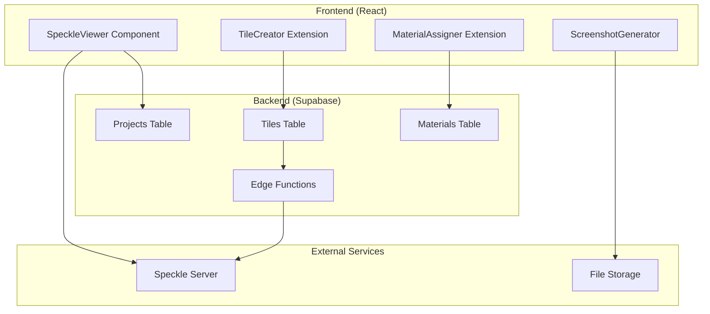

# PRD: Speckle 3D Viewer Integration dla FabManage

## 1. Product Vision \& Goals

### Vision Statement

Zintegrować Speckle 3D Viewer z systemem FabManage, umożliwiając interaktywne dzielenie modeli 3D na kafelki produkcyjne z automatycznym przypisywaniem materiałów i generowaniem wizualizacji.

### Business Goals

- **Redukcja czasu planowania** o 60% poprzez automatyczne dzielenie projektów na elementy
- **Zwiększenie dokładności szacowania materiałów** o 40% dzięki precyzyjnym obliczeniom na bazie geometrii 3D
- **Eliminacja błędów** w przypisywaniu materiałów przez wizualną weryfikację
- **Przygotowanie infrastruktury** pod przyszłe AI-powered material estimation


## 2. User Stories \& Acceptance Criteria

### Epic 1: 3D Model Loading \& Visualization

**Jako Project Manager chcę** załadować model 3D z Rhino do FabManage poprzez Speckle stream
**Aby** móc wizualnie planować produkcję w kontekście całego projektu

**Acceptance Criteria:**

- [x] Mogę wkleić URL Speckle stream w projekcie
- [x] Model ładuje się w <5 sekund dla plików <50MB
- [x] Mam podstawowe kontrole nawigacji (zoom, pan, rotate)
- [x] System automatycznie zapisuje link do modelu w bazie


### Epic 2: Interactive Tile Creation

**Jako Project Manager chcę** zaznaczać obiekty w modelu 3D i tworzyć z nich kafelki produkcyjne
**Aby** podzielić projekt na zarządzalne elementy produkcyjne

**Acceptance Criteria:**

- [x] Mogę przełączyć się w "tryb dzielenia" w viewerze
- [x] Mogę zaznaczać obiekty kliknięciem lub ramką selekcji
- [x] Zaznaczone obiekty są wizualnie wyróżnione
- [x] Mogę stworzyć kafelek z zaznaczonych obiektów jednym kliknięciem
- [x] Nowy kafelek zawiera ID obiektów Speckle i ich metadane


### Epic 3: Material Assignment \& BOM Generation

**Jako Project Manager chcę** przypisywać materiały do solidów i automatycznie generować BOM
**Aby** dokładnie szacować koszty i zapotrzebowanie materiałowe

**Acceptance Criteria:**

- [x] Mogę przypisać materiał z magazynu FabManage do zaznaczonego solidu
- [x] System automatycznie oblicza objętość i powierzchnię solidu
- [x] System szacuje ilość płyt/materiałów potrzebnych do produkcji
- [x] Automatycznie generowany BOM uwzględnia margines na odpad
- [x] Mogę skorygować automatyczne szacunki ręcznie


### Epic 4: Visual Documentation

**Jako Operator CNC chcę** widzieć zrzut ekranu 3D mojego zadania
**Aby** szybko zidentyfikować element do wyprodukowania

**Acceptance Criteria:**

- [x] Każdy kafelek ma automatycznie wygenerowany screenshot 3D
- [x] Screenshot pokazuje tylko elementy należące do kafelka
- [x] Screenshot ma odpowiednią rozdzielczość (1024x768)
- [x] Screenshot jest dostępny w widoku kafelka i na liście zadań CNC


## 3. Technical Overview

### Architecture Components




### Data Model Extensions

**Projects Table** (existing + new fields):

```sql
ALTER TABLE projects ADD COLUMN speckle_stream_url TEXT;
ALTER TABLE projects ADD COLUMN speckle_stream_id TEXT;
ALTER TABLE projects ADD COLUMN model_3d_status TEXT DEFAULT 'not_loaded';
```

**Tiles Table** (existing + new fields):

```sql
ALTER TABLE tiles ADD COLUMN speckle_object_ids JSONB;
ALTER TABLE tiles ADD COLUMN geometry_data JSONB;
ALTER TABLE tiles ADD COLUMN screenshot_url TEXT;
ALTER TABLE tiles ADD COLUMN material_assignments JSONB;
```

**New Table: tile_materials**:

```sql
CREATE TABLE tile_materials (
    id UUID PRIMARY KEY DEFAULT gen_random_uuid(),
    tile_id UUID REFERENCES tiles(id),
    material_id UUID REFERENCES materials(id),
    speckle_object_id TEXT,
    volume_m3 DECIMAL(10,6),
    area_m2 DECIMAL(10,4),
    estimated_plates INTEGER,
    waste_percentage DECIMAL(5,2) DEFAULT 15.0,
    created_at TIMESTAMP DEFAULT NOW()
);
```


### Core Technologies

- **Frontend**: React 18 + TypeScript + @speckle/viewer
- **Backend**: Supabase Edge Functions + PostgreSQL
- **3D Processing**: Three.js + Speckle ObjectLoader
- **Image Generation**: html2canvas / Three.js WebGL screenshot API
- **File Storage**: Supabase Storage dla screenshotów


## 4. Implementation Roadmap

### Phase 1: Foundation (Sprint 1-2, 4 tygodnie)

**Sprint 1 (2 tygodnie): Basic 3D Viewer**

- Week 1: Speckle viewer integration setup
- Week 2: Model loading \& basic navigation

**Sprint 2 (2 tygodnie): Data Layer**

- Week 3: Database schema migration
- Week 4: Basic CRUD operations for 3D models


### Phase 2: Interactive Features (Sprint 3-4, 4 tygodnie)

**Sprint 3 (2 tygodnie): Object Selection**

- Week 5: Selection modes implementation
- Week 6: Multi-select \& visual feedback

**Sprint 4 (2 tygodnie): Tile Creation**

- Week 7: Tile creation from selection
- Week 8: Integration with existing tile system


### Phase 3: Material Intelligence (Sprint 5-6, 4 tygodnie)

**Sprint 5 (2 tygodnie): Material Assignment**

- Week 9: Material picker integration
- Week 10: Volume/area calculations

**Sprint 6 (2 tygodnie): BOM Generation**

- Week 11: Automated BOM creation
- Week 12: Plate estimation algorithms


### Phase 4: Visual Documentation (Sprint 7, 2 tygodnie)

**Sprint 7 (2 tygodnie): Screenshot System**

- Week 13: 3D screenshot generation
- Week 14: File storage \& retrieval integration


### Phase 5: Polish \& Optimization (Sprint 8, 2 tygodnie)

**Sprint 8 (2 tygodnie): Performance \& UX**

- Week 15: Performance optimization
- Week 16: User acceptance testing \& fixes


## 5. Detailed Tasks Breakdown

### Sprint 1: Basic 3D Viewer

#### Backend Tasks

- [ ] **[DB-001]** Create database migration for projects.speckle_stream_url
- [ ] **[API-001]** Create Supabase Edge Function `speckle-auth` for token management
- [ ] **[API-002]** Add endpoints for saving/loading Speckle stream URLs


#### Frontend Tasks

- [ ] **[FE-001]** Install Speckle viewer dependencies (`@speckle/viewer`, `@speckle/objectloader`)
- [ ] **[FE-002]** Create `<SpeckleViewer>` React component with basic props
- [ ] **[FE-003]** Implement model loading from Speckle stream URL
- [ ] **[FE-004]** Add navigation controls (orbit, zoom, pan)
- [ ] **[FE-005]** Integrate viewer in project "Elementy" tab
- [ ] **[FE-006]** Create form for inputting Speckle stream URL
- [ ] **[FE-007]** Add loading states and error handling


#### Testing Tasks

- [ ] **[TEST-001]** Unit tests for SpeckleViewer component
- [ ] **[TEST-002]** Integration tests for model loading
- [ ] **[TEST-003]** E2E test for complete model load workflow


### Sprint 2: Data Layer

#### Backend Tasks

- [ ] **[DB-002]** Create tiles.speckle_object_ids column migration
- [ ] **[DB-003]** Create tiles.geometry_data column migration
- [ ] **[DB-004]** Create tile_materials table
- [ ] **[API-003]** Extend tiles API to handle Speckle object IDs
- [ ] **[API-004]** Create geometry data processing functions


#### Frontend Tasks

- [ ] **[FE-008]** Extend tilesStore to handle Speckle data
- [ ] **[FE-009]** Update tile creation forms to accept geometry data
- [ ] **[FE-010]** Add validation for Speckle object IDs


#### Testing Tasks

- [ ] **[TEST-004]** API tests for extended tiles endpoints
- [ ] **[TEST-005]** Database schema validation tests


### Sprint 3: Object Selection

#### Frontend Tasks

- [ ] **[FE-011]** Implement Speckle viewer extension system setup
- [ ] **[FE-012]** Create `TileSelectionExtension` class
- [ ] **[FE-013]** Add "Selection Mode" toggle in viewer UI
- [ ] **[FE-014]** Implement single-click object selection
- [ ] **[FE-015]** Implement box selection for multiple objects
- [ ] **[FE-016]** Add visual highlighting for selected objects
- [ ] **[FE-017]** Create selection state management
- [ ] **[FE-018]** Add keyboard shortcuts (Ctrl+click, Shift+drag)


#### Testing Tasks

- [ ] **[TEST-006]** Unit tests for selection extension
- [ ] **[TEST-007]** E2E tests for different selection modes


### Sprint 4: Tile Creation

#### Backend Tasks

- [ ] **[API-005]** Extend `createTile` endpoint to accept `speckle_object_ids[]`
- [ ] **[API-006]** Add validation for Speckle object data
- [ ] **[API-007]** Create geometry extraction from Speckle objects


#### Frontend Tasks

- [ ] **[FE-019]** Add "Create Tile from Selection" button in viewer
- [ ] **[FE-020]** Implement tile creation modal with pre-filled data
- [ ] **[FE-021]** Show selected objects count and IDs in UI
- [ ] **[FE-022]** Auto-populate tile name based on selected objects
- [ ] **[FE-023]** Add confirmation dialog with selection preview
- [ ] **[FE-024]** Update tiles list to show Speckle-created tiles differently


#### Integration Tasks

- [ ] **[INT-001]** Connect viewer selection with existing tile creation flow
- [ ] **[INT-002]** Ensure tiles created from 3D appear in Kanban boards


### Sprint 5: Material Assignment

#### Backend Tasks

- [ ] **[API-008]** Create `assignMaterialToObjects` Edge Function
- [ ] **[API-009]** Add volume/area calculation utilities
- [ ] **[API-010]** Create material-geometry relationship APIs


#### Frontend Tasks

- [ ] **[FE-025]** Create `MaterialAssignmentExtension` for viewer
- [ ] **[FE-026]** Implement material picker modal in 3D context
- [ ] **[FE-027]** Add material assignment to selected objects
- [ ] **[FE-028]** Show material properties in 3D (colors, labels)
- [ ] **[FE-029]** Create material assignment UI panel
- [ ] **[FE-030]** Integrate with existing materials database


### Sprint 6: BOM Generation

#### Backend Tasks

- [ ] **[API-011]** Create automated BOM generation function
- [ ] **[API-012]** Implement plate estimation algorithms
- [ ] **[API-013]** Add waste calculation logic
- [ ] **[API-014]** Create material cost calculation


#### Frontend Tasks

- [ ] **[FE-031]** Auto-generate BOM after material assignment
- [ ] **[FE-032]** Display estimated plates/materials in tile view
- [ ] **[FE-033]** Add manual BOM correction interface
- [ ] **[FE-034]** Show cost estimates in real-time
- [ ] **[FE-035]** Add BOM export functionality


### Sprint 7: Screenshot System

#### Backend Tasks

- [ ] **[API-015]** Setup Supabase Storage bucket for screenshots
- [ ] **[API-016]** Create file upload/retrieval endpoints
- [ ] **[API-017]** Add image optimization/resizing


#### Frontend Tasks

- [ ] **[FE-036]** Implement WebGL screenshot capture
- [ ] **[FE-037]** Create object isolation for clean screenshots
- [ ] **[FE-038]** Add optimal camera positioning for screenshots
- [ ] **[FE-039]** Implement automatic screenshot generation on tile creation
- [ ] **[FE-040]** Add screenshot display in tile cards/modals
- [ ] **[FE-041]** Create manual screenshot regeneration option


#### Screenshot Technical Specs

```javascript
const screenshotConfig = {
  width: 1024,
  height: 768,
  format: 'png',
  quality: 0.9,
  background: '#f8f9fa', // Light gray
  camera: 'auto-fit', // Auto-position for best view
  lighting: 'studio' // Optimal lighting setup
}
```


### Sprint 8: Polish \& Optimization

#### Performance Tasks

- [ ] **[PERF-001]** Implement Level-of-Detail (LOD) for large models
- [ ] **[PERF-002]** Add progressive loading for complex geometries
- [ ] **[PERF-003]** Optimize screenshot generation performance
- [ ] **[PERF-004]** Add caching for material assignments
- [ ] **[PERF-005]** Memory leak prevention and cleanup


#### UX Tasks

- [ ] **[UX-001]** Add onboarding tooltips for 3D viewer
- [ ] **[UX-002]** Improve error messages and validation
- [ ] **[UX-003]** Add keyboard shortcuts documentation
- [ ] **[UX-004]** Implement dark mode for 3D viewer
- [ ] **[UX-005]** Add accessibility features (ARIA labels)


#### Testing Tasks

- [ ] **[TEST-008]** Complete E2E test suite for all workflows
- [ ] **[TEST-009]** Performance benchmarking tests
- [ ] **[TEST-010]** Cross-browser compatibility testing
- [ ] **[TEST-011]** Mobile responsiveness testing
- [ ] **[TEST-012]** User acceptance testing with production data


## 6. Success Metrics \& KPIs

### Technical Metrics

- **Model Load Time**: <3 seconds for files <50MB
- **Selection Response Time**: <100ms for object selection
- **Screenshot Generation**: <2 seconds per image
- **Memory Usage**: <512MB for typical models
- **Error Rate**: <1% for core functionality


### Business Metrics

- **User Adoption**: >80% Project Managers using 3D viewer within 2 months
- **Time Savings**: 60% reduction in project planning time
- **BOM Accuracy**: 40% improvement in material estimates
- **User Satisfaction**: >4.5/5 rating in internal surveys


### Quality Gates

- [ ] All unit tests passing (>95% coverage)
- [ ] All E2E tests passing
- [ ] Performance benchmarks met
- [ ] Security audit completed
- [ ] User acceptance testing approved
- [ ] Documentation complete


## 7. Risk Assessment \& Mitigation

| Risk | Impact | Probability | Mitigation |
| :-- | :-- | :-- | :-- |
| **Speckle API limitations** | High | Medium | Create fallback viewer with Three.js |
| **Large model performance** | High | High | Implement LOD and progressive loading |
| **Browser compatibility** | Medium | Low | Extensive testing, WebGL fallbacks |
| **Screenshot quality** | Medium | Medium | Multiple rendering approaches |
| **User adoption resistance** | High | Medium | Extensive training, gradual rollout |

Ten PRD i roadmap dają solidne fundamenty do implementacji kompleksnej integracji Speckle z FabManage, z naciskiem na praktyczne zastosowania w środowisku produkcyjnym.

