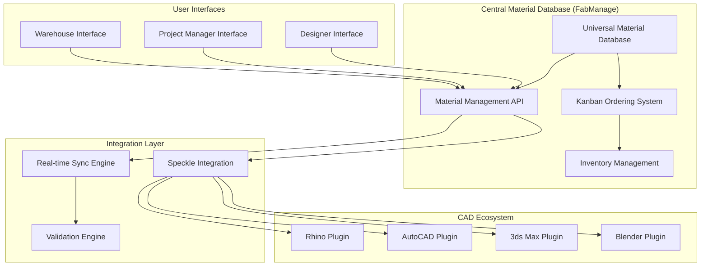

# PRD: Universal Material Management System (UMMS)

*Integracja FabManage ↔ Speckle ↔ CAD Programs*

## 1. Vision \& Strategic Goals

### Product Vision

Stworzenie **zunifikowanego ekosystemu materiałów**, który łączy projektowanie CAD, zarządzanie produkcją i magazyn w jedną spójną platformę, umożliwiającą real-time współpracę między projektantami, production managerami i magazynierami.

### Strategic Objectives

- **Centralizacja wiedzy materiałowej** - jedna baza prawdy dla wszystkich materiałów
- **Real-time inventory awareness** - projektanci widzą stany magazynowe podczas projektowania
- **Intelligent material validation** - automatyczna weryfikacja zgodności projektu z rzeczywistością
- **Universal material concept** - od płyt MDF po śruby M6, wszystko jako "materiał"
- **Seamless workflow** - płynne przejście od projektu do produkcji do zamówienia


## 2. System Architecture Overview




## 3. Universal Material Data Model

### Core Material Entity

```json
{
  "id": "uuid",
  "fabManageCode": "MDF_18_STD_001", 
  "universalName": "MDF 18mm Standard White",
  "category": "SHEET_MATERIAL", // SHEET_MATERIAL, HARDWARE, LIGHTING, CUSTOM
  "type": "MDF",
  
  "physicalProperties": {
    "thickness": 18, // mm
    "density": 750, // kg/m³
    "dimensions": {
      "length": 2500, // mm
      "width": 1250, // mm
      "area": 3.125 // m²
    },
    "weight": 60, // kg per sheet
    "color": "#F5F5DC",
    "finish": "sanded_both_sides"
  },
  
  "designProperties": {
    "renderColor": "#F5F5DC",
    "roughness": 0.8,
    "metallic": 0.0,
    "transparency": 0.0,
    "textureMap": "url_to_texture",
    "bumpMap": "url_to_bump"
  },
  
  "validationRules": {
    "allowedThickness": [16, 17, 18, 19, 20], // mm tolerance
    "warningThreshold": 1.0, // mm
    "errorThreshold": 3.0, // mm
    "cuttingConstraints": {
      "minCutWidth": 10, // mm
      "kerf": 3 // mm
    }
  },
  
  "inventoryData": {
    "currentStock": 45,
    "unit": "sheets",
    "reservedQuantity": 12,
    "availableQuantity": 33,
    "minStockLevel": 10,
    "maxStockLevel": 100,
    "reorderPoint": 15,
    "leadTime": 7, // days
    "supplierId": "supplier_uuid"
  },
  
  "costData": {
    "costPerUnit": 67.50,
    "currency": "PLN", 
    "lastUpdated": "2025-09-10T08:00:00Z",
    "priceHistory": []
  },
  
  "metadata": {
    "isStandardItem": true,
    "isCustomOrder": false,
    "datasheet": "url_to_pdf",
    "certifications": ["CE", "FSC"],
    "createdBy": "user_id",
    "lastModified": "2025-09-10T08:00:00Z"
  }
}
```


### Custom/One-off Materials

```json
{
  "id": "uuid",
  "fabManageCode": "CUSTOM_LED_STRIP_PROJECT_001",
  "universalName": "LED Strip 3000K 24V Custom Length",
  "category": "CUSTOM",
  "parentMaterialId": "standard_led_strip_id", // Reference to base material
  
  "customProperties": {
    "totalLength": 15.7, // meters - custom dla tego projektu
    "cuttingPoints": [2.5, 5.0, 8.2, 12.1], // specific cutting requirements
    "specialInstructions": "Solder connectors every 2.5m"
  },
  
  "orderStatus": "TO_ORDER", // TO_ORDER, ORDERED, RECEIVED, USED
  "projectId": "project_uuid",
  "estimatedCost": 450.00,
  "supplier": "Led Solutions Sp. z o.o.",
  
  "inventoryData": {
    "currentStock": 0,
    "reservedFor": "project_uuid",
    "expectedDelivery": "2025-09-20"
  }
}
```


## 4. CAD Plugin Architecture

### Universal Plugin Framework

```javascript
// Base class for all CAD plugins
class FabManageCADPlugin {
  constructor(cadInterface) {
    this.cad = cadInterface
    this.materialDB = new MaterialDatabaseClient()
    this.validator = new ThicknessValidator()
    this.syncEngine = new RealtimeSyncEngine()
  }
  
  // Core functions implemented in each CAD plugin
  async loadMaterialLibrary() { }
  async applyMaterialToObjects(objectIds, materialId) { }
  async validateObjectThickness(objectId, expectedThickness) { }
  async selectObjectsByMaterial(materialId) { }
  async hideObjectsByMaterial(materialId) { }
  async isolateObjectsByMaterial(materialId) { }
}
```


### Rhino Plugin Specific Implementation

```csharp
// Rhino C# Plugin
public class FabManageRhinoPlugin : PlugIn
{
    private MaterialManager materialManager;
    private ValidationEngine validator;
    
    public override PlugInLoadTime LoadTime => PlugInLoadTime.AtStartup;
    
    protected override LoadReturnCode OnLoad(ref string errorMessage)
    {
        materialManager = new MaterialManager();
        validator = new ValidationEngine();
        
        // Register custom commands
        RegisterCommand(typeof(FabManageApplyMaterialCommand));
        RegisterCommand(typeof(FabManageValidateThicknessCommand));
        RegisterCommand(typeof(FabManageSelectByMaterialCommand));
        
        return LoadReturnCode.Success;
    }
    
    // Real-time thickness validation
    public void ValidateObjectThickness(Guid objectId, double expectedThickness)
    {
        var obj = RhinoDoc.ActiveDoc.Objects.Find(objectId);
        var actualThickness = GeometryAnalyzer.GetThickness(obj.Geometry);
        
        if (Math.Abs(actualThickness - expectedThickness) > 1.0) // 1mm tolerance
        {
            ShowThicknessWarning(objectId, actualThickness, expectedThickness);
        }
    }
}

// Custom Rhino Command for applying FabManage materials
[CommandStyle(Style.ScriptRunner)]
public class FabManageApplyMaterialCommand : Command
{
    public override string EnglishName => "FabManageApplyMaterial";
    
    protected override Result RunCommand(RhinoDoc doc, RunMode mode)
    {
        // Show material picker with real-time inventory
        var materialPicker = new MaterialPickerDialog();
        materialPicker.ShowStockLevels = true;
        materialPicker.FilterByAvailable = UserSettings.FilterByStock;
        
        if (materialPicker.ShowDialog() == DialogResult.OK)
        {
            var selectedMaterial = materialPicker.SelectedMaterial;
            var selectedObjects = GetSelectedObjects();
            
            ApplyMaterialToObjects(selectedObjects, selectedMaterial);
            ValidateAllThicknesses(selectedObjects, selectedMaterial);
        }
        
        return Result.Success;
    }
}
```


### AutoCAD Plugin (.NET API)

```csharp
public class FabManageAutoCADPlugin : IExtensionApplication
{
    public void Initialize()
    {
        // Register ribbon tabs and panels
        CreateFabManageRibbon();
        
        // Hook into drawing events for real-time validation
        Application.DocumentManager.DocumentActivated += OnDocumentActivated;
        Database.ObjectModified += OnObjectModified;
    }
    
    [CommandMethod("FABMANAGE_MATERIAL")]
    public void ApplyFabManageMaterial()
    {
        var doc = Application.DocumentManager.MdiActiveDocument;
        var ed = doc.Editor;
        
        // Material selection with inventory awareness
        var materialDialog = new MaterialSelectionDialog();
        materialDialog.ShowInventoryLevels = true;
        
        if (materialDialog.ShowModal() == DialogResult.OK)
        {
            var selection = ed.GetSelection();
            ApplyMaterialWithValidation(selection.Value, materialDialog.SelectedMaterial);
        }
    }
    
    private void OnObjectModified(object sender, ObjectEventArgs e)
    {
        // Real-time thickness validation during modeling
        ValidateObjectThickness(e.DBObject);
    }
}
```


## 5. Real-time Validation System

### Thickness Validation Engine

```javascript
class ThicknessValidator {
  constructor() {
    this.toleranceSettings = {
      warning: 1.0, // mm
      error: 3.0, // mm
      autoCorrect: 0.5 // mm
    }
  }
  
  async validateObject(objectId, assignedMaterial) {
    const geometry = await this.cad.getObjectGeometry(objectId)
    const actualThickness = this.calculateThickness(geometry)
    const expectedThickness = assignedMaterial.physicalProperties.thickness
    
    const deviation = Math.abs(actualThickness - expectedThickness)
    
    if (deviation > this.toleranceSettings.error) {
      return {
        status: 'ERROR',
        message: `Critical thickness mismatch: ${actualThickness}mm vs expected ${expectedThickness}mm`,
        action: 'BLOCK_PRODUCTION'
      }
    } else if (deviation > this.toleranceSettings.warning) {
      return {
        status: 'WARNING', 
        message: `Thickness deviation: ${actualThickness}mm (expected ${expectedThickness}mm)`,
        action: 'REQUIRE_CONFIRMATION'
      }
    } else if (deviation < this.toleranceSettings.autoCorrect) {
      return {
        status: 'AUTO_CORRECTED',
        message: `Minor deviation auto-corrected to ${expectedThickness}mm`,
        action: 'UPDATE_GEOMETRY'
      }
    }
    
    return { status: 'VALID' }
  }
}
```


### Material-based Object Management

```javascript
class MaterialObjectManager {
  // Select all objects with specific material
  async selectByMaterial(materialId) {
    const objects = await this.cad.getAllObjects()
    const filtered = objects.filter(obj => obj.materialId === materialId)
    await this.cad.selectObjects(filtered.map(obj => obj.id))
  }
  
  // Hide objects by material (useful for focusing on specific materials)
  async hideByMaterial(materialId) {
    const objects = await this.getObjectsByMaterial(materialId)
    await this.cad.hideObjects(objects)
  }
  
  // Isolate only objects with specific material
  async isolateByMaterial(materialId) {
    const allObjects = await this.cad.getAllObjects()
    const materialObjects = allObjects.filter(obj => obj.materialId === materialId)
    const otherObjects = allObjects.filter(obj => obj.materialId !== materialId)
    
    await this.cad.hideObjects(otherObjects)
    await this.cad.showObjects(materialObjects)
  }
  
  // Lock objects by material (prevent accidental modification)
  async lockByMaterial(materialId) {
    const objects = await this.getObjectsByMaterial(materialId)
    await this.cad.lockObjects(objects)
  }
}
```


## 6. Material Ordering Kanban System

### Kanban Board Structure in FabManage

```javascript
const materialKanbanColumns = {
  DESIGN_PHASE: {
    title: "W Projekcie",
    materials: [], // Materials assigned but not yet needed
    color: "#E3F2FD"
  },
  TO_ORDER: {
    title: "Do Zamówienia", 
    materials: [], // Materials below reorder point or custom items
    color: "#FFF3E0",
    assignedTo: ["project_manager", "warehouse_manager"]
  },
  ORDERED: {
    title: "Zamówione",
    materials: [], // Orders placed, waiting for delivery
    color: "#F3E5F5",
    showEstimatedDelivery: true
  },
  RECEIVED: {
    title: "Odebrane",
    materials: [], // Delivered and in warehouse
    color: "#E8F5E8"
  },
  IN_PRODUCTION: {
    title: "W Produkcji", 
    materials: [], // Currently being used
    color: "#FFF8E1"
  },
  USED: {
    title: "Wykorzystane",
    materials: [], // Completed projects
    color: "#FAFAFA"
  }
}
```


### Smart Material Ordering Logic

```javascript
class MaterialOrderingEngine {
  async checkMaterialRequirements(projectId) {
    const project = await this.getProject(projectId)
    const requiredMaterials = await this.calculateProjectMaterials(project)
    
    for (let material of requiredMaterials) {
      const inventory = await this.getInventoryLevel(material.id)
      const status = this.determineOrderStatus(material, inventory)
      
      await this.updateMaterialKanban(material.id, status, {
        projectId: projectId,
        requiredQuantity: material.quantity,
        requiredDate: project.productionStartDate
      })
    }
  }
  
  determineOrderStatus(material, inventory) {
    if (material.isCustomOrder) {
      return 'TO_ORDER' // Custom materials always need ordering
    }
    
    if (inventory.available < material.requiredQuantity) {
      if (inventory.available + inventory.onOrder >= material.requiredQuantity) {
        return 'ORDERED' // Sufficient quantity on order
      } else {
        return 'TO_ORDER' // Need to order more
      }
    }
    
    return 'AVAILABLE' // Sufficient stock
  }
}
```


## 7. Designer Interface in CAD Programs

### Material Browser Panel

```javascript
// Embedded panel in CAD software
class MaterialBrowserPanel {
  constructor() {
    this.filters = {
      category: 'ALL', // SHEET_MATERIAL, HARDWARE, LIGHTING, etc.
      availability: 'ALL', // IN_STOCK, LOW_STOCK, OUT_OF_STOCK
      priceRange: { min: 0, max: 1000 }
    }
  }
  
  renderMaterialList() {
    return `
      <div class="material-browser">
        <div class="filters">
          <select id="category-filter">
            <option value="ALL">Wszystkie kategorie</option>
            <option value="SHEET_MATERIAL">Płyty</option>
            <option value="HARDWARE">Okucia</option>
            <option value="LIGHTING">Oświetlenie</option>
          </select>
          
          <label>
            <input type="checkbox" id="in-stock-only"> 
            Tylko na stanie
          </label>
        </div>
        
        <div class="material-grid">
          ${this.materials.map(material => `
            <div class="material-card ${this.getStockClass(material)}">
              <div class="material-preview" style="background-color: ${material.designProperties.renderColor}">
                
              </div>
              
              <div class="material-info">
                <h4>${material.universalName}</h4>
                <div class="stock-info">
                  <span class="stock-level">Na stanie: ${material.inventoryData.availableQuantity}</span>
                  <span class="stock-unit">${material.inventoryData.unit}</span>
                </div>
                <div class="price">
                  ${material.costData.costPerUnit} ${material.costData.currency}/${material.inventoryData.unit}
                </div>
              </div>
              
              <div class="material-actions">
                <button onclick="applyMaterial('${material.id}')">Zastosuj</button>
                <button onclick="showMaterialDetails('${material.id}')">Szczegóły</button>
              </div>
            </div>
          `).join('')}
        </div>
      </div>
    `
  }
  
  getStockClass(material) {
    if (material.inventoryData.availableQuantity === 0) return 'out-of-stock'
    if (material.inventoryData.availableQuantity <= material.inventoryData.reorderPoint) return 'low-stock'
    return 'in-stock'
  }
}
```


## 8. Implementation Roadmap

### Phase 1: Core Infrastructure (4 weeks)

**Week 1-2: Database \& API**

- [ ] Design Universal Material Database schema
- [ ] Create Material Management API endpoints
- [ ] Implement basic CRUD operations
- [ ] Setup Kanban board data model

**Week 3-4: Speckle Integration**

- [ ] Create Speckle material object types
- [ ] Implement material sync between FabManage and Speckle
- [ ] Setup real-time material data streaming


### Phase 2: CAD Plugins Development (8 weeks)

**Week 5-8: Rhino Plugin**

- [ ] Create Rhino plugin foundation
- [ ] Implement material browser panel
- [ ] Add thickness validation system
- [ ] Create object selection/management by material

**Week 9-12: AutoCAD Plugin**

- [ ] Port Rhino functionality to AutoCAD .NET API
- [ ] Create AutoCAD ribbon interface
- [ ] Implement DWG layer-material mapping
- [ ] Add real-time validation hooks


### Phase 3: Advanced Features (6 weeks)

**Week 13-15: Validation \& Intelligence**

- [ ] Advanced thickness validation algorithms
- [ ] Smart material suggestions based on geometry
- [ ] Automated BOM generation from assigned materials
- [ ] Integration with production constraints

**Week 16-18: Ordering System**

- [ ] Complete Kanban ordering workflow
- [ ] Automated reorder point calculations
- [ ] Supplier integration for real-time pricing
- [ ] Custom material ordering system


### Phase 4: Enterprise Features (4 weeks)

**Week 19-20: 3ds Max \& Blender Plugins**

- [ ] Extend plugin architecture to other CAD software
- [ ] Unified material library across all platforms

**Week 21-22: AI \& Analytics**

- [ ] Material usage analytics
- [ ] Predictive ordering based on project pipeline
- [ ] Cost optimization recommendations


## 9. Technical Specifications

### API Endpoints Structure

```typescript
// Material Management API
interface MaterialAPI {
  // Core CRUD
  getMaterials(filters?: MaterialFilters): Promise<Material[]>
  getMaterial(id: string): Promise<Material>
  createMaterial(material: CreateMaterialDTO): Promise<Material>
  updateMaterial(id: string, updates: UpdateMaterialDTO): Promise<Material>
  deleteMaterial(id: string): Promise<void>
  
  // Inventory management
  getInventoryLevel(materialId: string): Promise<InventoryData>
  updateStock(materialId: string, quantity: number, operation: 'ADD' | 'SUBTRACT'): Promise<void>
  reserveMaterial(materialId: string, quantity: number, projectId: string): Promise<void>
  
  // Validation
  validateThickness(materialId: string, actualThickness: number): Promise<ValidationResult>
  getMaterialConstraints(materialId: string): Promise<MaterialConstraints>
  
  // Kanban & Ordering
  getMaterialKanban(projectId: string): Promise<KanbanBoard>
  moveMaterialToColumn(materialId: string, fromColumn: string, toColumn: string): Promise<void>
  createMaterialOrder(materialId: string, quantity: number): Promise<Order>
}
```


### Real-time Event System

```javascript
// WebSocket events for real-time updates
const materialEvents = {
  MATERIAL_UPDATED: 'material:updated',
  STOCK_CHANGED: 'inventory:stock_changed', 
  VALIDATION_FAILED: 'validation:thickness_mismatch',
  ORDER_STATUS_CHANGED: 'order:status_changed',
  MATERIAL_APPLIED: 'cad:material_applied'
}

// Plugin event handling
class CADPluginEventHandler {
  onMaterialUpdated(material) {
    // Update material library in CAD
    this.materialLibrary.update(material)
    this.refreshMaterialBrowser()
  }
  
  onStockChanged(materialId, newStock) {
    // Update stock indicators in material browser
    this.updateStockIndicator(materialId, newStock)
    
    // Show warning if material goes out of stock
    if (newStock === 0) {
      this.showOutOfStockWarning(materialId)
    }
  }
  
  onValidationFailed(objectId, validationResult) {
    // Highlight problematic object in CAD
    this.highlightObject(objectId, 'error')
    this.showValidationDialog(validationResult)
  }
}
```


## 10. Success Metrics \& KPIs

### Technical KPIs

- **Material sync latency**: <500ms between FabManage and CAD plugins
- **Validation response time**: <100ms for thickness checks
- **Plugin performance**: No noticeable CAD software slowdown
- **Data accuracy**: 99.9% consistency across all platforms


### Business KPIs

- **Design efficiency**: 40% reduction in material assignment time
- **Inventory optimization**: 25% reduction in excess stock
- **Order accuracy**: 90% reduction in wrong material orders
- **Cost savings**: 15% reduction in material costs through better visibility


### User Adoption Metrics

- **Designer adoption**: >85% of designers using material plugins within 3 months
- **Material database completeness**: >95% of used materials properly catalogued
- **Validation compliance**: >90% of thickness validation warnings addressed
- **Order workflow usage**: >80% of material orders going through Kanban system

Ten system UMMS będzie rewolucyjny dla przemysłu - pierwszy raz projektanci będą mieli real-time dostęp do stanów magazynowych podczas projektowania, a cały workflow od projektu do produkcji będzie w pełni zintegrowany i zautomatyzowany.

