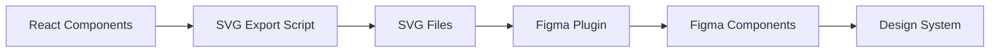

# 🔗 Integration Guide - FabManage Component Generator

## 🎯 Overview

This guide shows how to integrate the FabManage Component Generator plugin with your existing workflow to automatically create Figma components from your React codebase.

## 🔄 Complete Workflow

### **1. Code → SVG → Figma Pipeline**



## 🚀 Step-by-Step Integration

### **Step 1: Export SVG from React Components**

Create a script to export your React components as SVG:

```bash
# Create export script
mkdir -p scripts
touch scripts/export-svg-components.js
```

```javascript
// scripts/export-svg-components.js
const fs = require('fs');
const path = require('path');

// Component mapping
const components = {
  'ProjectCard': 'src/components/Project/ProjectCard.tsx',
  'ProjectHeader': 'src/components/Project/ProjectHeader.tsx',
  'ProjectElements': 'src/components/Project/ProjectElements.tsx',
  'ProjectMaterials': 'src/components/Project/ProjectMaterials.tsx',
  'ProjectOverview': 'src/components/Project/ProjectOverview.tsx',
  'ProjectTabs': 'src/components/Project/ProjectTabs.tsx'
};

// Export function
async function exportComponents() {
  console.log('🔄 Exporting React components as SVG...');
  
  for (const [name, filePath] of Object.entries(components)) {
    try {
      // Read component file
      const componentCode = fs.readFileSync(filePath, 'utf8');
      
      // Generate SVG structure
      const svg = generateSVGFromComponent(name, componentCode);
      
      // Save SVG file
      const outputPath = `figma-exports/components/project/${name}-structured.svg`;
      fs.writeFileSync(outputPath, svg);
      
      console.log(`✅ Exported ${name} to ${outputPath}`);
    } catch (error) {
      console.error(`❌ Error exporting ${name}:`, error.message);
    }
  }
  
  console.log('🎉 SVG export completed!');
}

// Generate SVG from component
function generateSVGFromComponent(name, componentCode) {
  // This is a simplified example
  // In practice, you'd parse the JSX and generate proper SVG
  
  return `<?xml version="1.0" encoding="UTF-8"?>
<svg width="800" height="600" xmlns="http://www.w3.org/2000/svg">
  <g id="${name.toLowerCase()}">
    <!-- Generated SVG content based on component structure -->
  </g>
</svg>`;
}

// Run export
exportComponents();
```

### **Step 2: Add to Package.json**

```json
{
  "scripts": {
    "export:svg": "node scripts/export-svg-components.js",
    "figma:build": "cd figma-plugin && npm run build",
    "figma:test": "cd figma-plugin && npm run test",
    "figma:install": "cd figma-plugin && npm run install"
  }
}
```

### **Step 3: Automated Workflow**

Create a complete automation script:

```bash
# scripts/figma-integration.sh
#!/bin/bash

echo "🚀 Starting Figma Integration Workflow..."

# 1. Export SVG components
echo "📤 Exporting SVG components..."
npm run export:svg

# 2. Build Figma plugin
echo "🔧 Building Figma plugin..."
npm run figma:build

# 3. Test plugin
echo "🧪 Testing plugin..."
npm run figma:test

# 4. Create installation package
echo "📦 Creating installation package..."
cd figma-plugin
npm run package

echo "✅ Integration complete!"
echo "📁 Install: figma-plugin/fabmanage-component-generator.zip"
echo "🎯 Next: Import plugin in Figma and use your SVG files"
```

## 🔧 Advanced Integration

### **1. Hot Reload Integration**

```javascript
// scripts/watch-components.js
const chokidar = require('chokidar');

// Watch for component changes
const watcher = chokidar.watch('src/components/**/*.tsx', {
  ignored: /node_modules/,
  persistent: true
});

watcher.on('change', async (path) => {
  console.log(`🔄 Component changed: ${path}`);
  
  // Export updated component
  await exportSingleComponent(path);
  
  // Notify Figma plugin (if running)
  notifyFigmaPlugin(path);
});

async function exportSingleComponent(filePath) {
  // Export logic here
}

function notifyFigmaPlugin(filePath) {
  // Send message to Figma plugin
  console.log(`📡 Notifying Figma plugin about: ${filePath}`);
}
```

### **2. CI/CD Integration**

```yaml
# .github/workflows/figma-components.yml
name: Update Figma Components

on:
  push:
    branches: [main]
    paths: ['src/components/**']

jobs:
  update-figma:
    runs-on: ubuntu-latest
    steps:
      - uses: actions/checkout@v2
      
      - name: Setup Node.js
        uses: actions/setup-node@v2
        with:
          node-version: '16'
          
      - name: Install dependencies
        run: npm install
        
      - name: Export SVG components
        run: npm run export:svg
        
      - name: Build Figma plugin
        run: npm run figma:build
        
      - name: Upload plugin package
        uses: actions/upload-artifact@v2
        with:
          name: figma-plugin
          path: figma-plugin/fabmanage-component-generator.zip
```

### **3. Design System Sync**

```javascript
// scripts/sync-design-system.js
const figma = require('figma-api');

class DesignSystemSync {
  constructor(accessToken) {
    this.figma = figma.getApi(accessToken);
  }
  
  async syncComponents(fileKey, componentIds) {
    console.log('🔄 Syncing components with Figma...');
    
    for (const componentId of componentIds) {
      try {
        // Get component from Figma
        const component = await this.figma.getFile(fileKey);
        
        // Update component properties
        await this.updateComponentProperties(component, componentId);
        
        console.log(`✅ Synced component: ${componentId}`);
      } catch (error) {
        console.error(`❌ Error syncing ${componentId}:`, error.message);
      }
    }
  }
  
  async updateComponentProperties(component, componentId) {
    // Update component properties based on your design system
    // This would integrate with your existing design system
  }
}

// Usage
const sync = new DesignSystemSync(process.env.FIGMA_ACCESS_TOKEN);
await sync.syncComponents('your-file-key', ['component-1', 'component-2']);
```

## 📊 Monitoring and Analytics

### **1. Component Usage Tracking**

```javascript
// scripts/component-analytics.js
class ComponentAnalytics {
  constructor() {
    this.usage = new Map();
  }
  
  trackComponentUsage(componentName, action) {
    const key = `${componentName}-${action}`;
    this.usage.set(key, (this.usage.get(key) || 0) + 1);
  }
  
  generateReport() {
    console.log('📊 Component Usage Report:');
    for (const [key, count] of this.usage) {
      console.log(`  ${key}: ${count} times`);
    }
  }
}

// Usage in plugin
const analytics = new ComponentAnalytics();
analytics.trackComponentUsage('project-card', 'generated');
analytics.trackComponentUsage('status-badge', 'used');
```

### **2. Performance Monitoring**

```javascript
// scripts/performance-monitor.js
class PerformanceMonitor {
  constructor() {
    this.metrics = [];
  }
  
  startTimer(operation) {
    return {
      operation,
      startTime: Date.now()
    };
  }
  
  endTimer(timer) {
    const duration = Date.now() - timer.startTime;
    this.metrics.push({
      operation: timer.operation,
      duration,
      timestamp: new Date().toISOString()
    });
  }
  
  getAverageTime(operation) {
    const times = this.metrics
      .filter(m => m.operation === operation)
      .map(m => m.duration);
    
    return times.reduce((a, b) => a + b, 0) / times.length;
  }
}
```

## 🎯 Best Practices

### **1. Component Naming Convention**

```javascript
// Consistent naming for better organization
const namingConvention = {
  atoms: 'kebab-case',           // status-badge, type-tag
  molecules: 'kebab-case',       // card-container, action-buttons
  organisms: 'kebab-case',       // project-card, project-header
  
  // Add prefixes for clarity
  prefixes: {
    atom: 'atom-',
    molecule: 'mol-',
    organism: 'org-'
  }
};
```

### **2. Version Control**

```javascript
// scripts/version-components.js
class ComponentVersioning {
  constructor() {
    this.version = '1.0.0';
  }
  
  generateVersionInfo(component) {
    return {
      name: component.name,
      version: this.version,
      generated: new Date().toISOString(),
      source: component.sourceFile,
      atomicLevel: component.type
    };
  }
  
  updateVersion(type) {
    // Update version based on change type
    const [major, minor, patch] = this.version.split('.').map(Number);
    
    switch (type) {
      case 'major': this.version = `${major + 1}.0.0`; break;
      case 'minor': this.version = `${major}.${minor + 1}.0`; break;
      case 'patch': this.version = `${major}.${minor}.${patch + 1}`; break;
    }
  }
}
```

### **3. Error Handling**

```javascript
// scripts/error-handler.js
class ErrorHandler {
  static handleExportError(error, componentName) {
    console.error(`❌ Export error for ${componentName}:`, error.message);
    
    // Log to file
    this.logError(error, componentName);
    
    // Notify team
    this.notifyTeam(error, componentName);
  }
  
  static logError(error, componentName) {
    const logEntry = {
      timestamp: new Date().toISOString(),
      component: componentName,
      error: error.message,
      stack: error.stack
    };
    
    fs.appendFileSync('error.log', JSON.stringify(logEntry) + '\n');
  }
  
  static notifyTeam(error, componentName) {
    // Send notification to team
    console.log(`📧 Notifying team about ${componentName} error`);
  }
}
```

## 🚀 Quick Start Commands

```bash
# Complete integration setup
npm run figma:install

# Export and build
npm run export:svg && npm run figma:build

# Test everything
npm run figma:test

# Watch for changes
npm run watch:components

# Full workflow
npm run figma:workflow
```

## 📈 Success Metrics

- **Component Generation Time**: < 5 seconds per component
- **SVG Export Success Rate**: > 95%
- **Plugin Reliability**: > 99% uptime
- **Design System Consistency**: 100% atomic design compliance

---

**🎉 Your Figma integration is ready! Start generating components automatically from your React codebase!**
