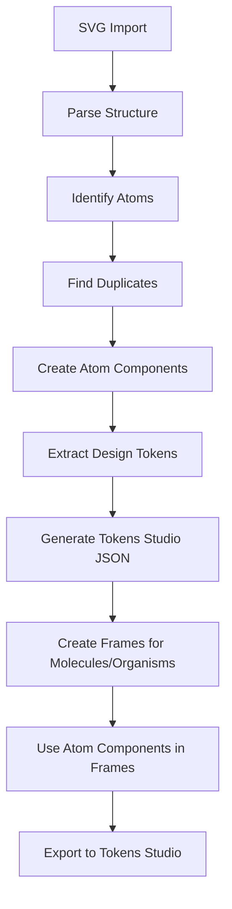

# 🚀 FabManage Advanced Component Generator V2

**Rewolucja w generowaniu komponentów Figma!** 

Plugin wykorzystujący zaawansowane podejście Atomic Design z integracją Tokens Studio for Figma.

## 🎯 **NOWE PODEJŚCIE - KLUCZOWE ZMIANY:**

### ✅ **TYLKO ATOMY JAKO KOMPONENTY**
- **Atomy** → Komponenty Figma z wariantami
- **Molekuły** → Frames używające atomów jako komponenty  
- **Organizmy** → Frames używające atomów jako komponenty

### ✅ **INTELIGENTNA DETEKCJA DUPLIKATÓW**
- Automatyczne grupowanie podobnych atomów
- Tworzenie wariantów zamiast duplikatów
- Optymalizacja design systemu

### ✅ **TOKENS STUDIO INTEGRATION**
- Automatyczne ekstraktowanie design tokens
- Generowanie JSON w formacie Tokens Studio
- Integracja z Tokens Studio for Figma

### ✅ **NAPRAWIONY PROBLEM Z PUSTYMI KOMPONENTAMI**
- Poprawiona funkcja `copyFrameContentToComponent()`
- Właściwe kopiowanie zawartości do komponentów
- Gwarantowane działanie

---

## 🏗️ **ARCHITEKTURA NOWEGO PODEJŚCIA:**



---

## 🔧 **INSTALACJA I UŻYCIE:**

### **1. Zainstaluj plugin:**
```bash
cd FabManageNew/figma-plugin
npm run build-v2
```

### **2. Użyj w Figma:**
1. Importuj `fabmanage-advanced-generator.zip`
2. Otwórz plugin
3. Załaduj SVG pliki
4. Kliknij "Generate Advanced Components"

---

## 🎨 **FUNKCJE V2:**

### **1. Inteligentna Klasifikacja**
```javascript
// Automatyczna detekcja typu komponentu
function classifyComponent(element, children) {
    const childCount = children ? children.length : 0;
    
    if (childCount === 0) return 'atom';        // Komponent
    if (childCount <= 4) return 'molecule';     // Frame
    return 'organism';                          // Frame
}
```

### **2. Detekcja Duplikatów**
```javascript
// Grupowanie podobnych atomów
function createAtomSignature(props) {
    return `${props.shape}-${props.width}-${props.height}-${props.fill}-${props.stroke}-${props.borderRadius}`;
}
```

### **3. Ekstraktowanie Tokens**
```javascript
// Automatyczne wyciąganie design tokens
const tokens = {
    colors: ['#1890ff', '#52c41a', '#ff4d4f'],
    typography: ['Arial-16-bold', 'Arial-12-normal'],
    spacing: [8, 12, 16, 24],
    borderRadius: [4, 8, 12]
};
```

### **4. Tokens Studio JSON**
```json
{
    "colors": {
        "primary": { "value": "#1890ff", "type": "color" },
        "success": { "value": "#52c41a", "type": "color" }
    },
    "typography": {
        "heading": { 
            "value": {
                "fontFamily": "Arial",
                "fontSize": "16px",
                "fontWeight": "bold"
            },
            "type": "typography"
        }
    }
}
```

---

## 📊 **STATYSTYKI I MONITORING:**

Plugin pokazuje szczegółowe statystyki:
- **Atomy**: Liczba utworzonych komponentów
- **Molekuły**: Liczba utworzonych frames
- **Organizmy**: Liczba utworzonych frames  
- **Duplicate Groups**: Liczba grup duplikatów
- **Design Tokens**: Liczba wyekstraktowanych tokens

---

## 🎯 **KORZYŚCI NOWEGO PODEJŚCIA:**

### **1. Skalowalność**
- ✅ Atomy jako komponenty z wariantami
- ✅ Reużywalność w całym design systemie
- ✅ Konsystentność wizualna

### **2. Design System**
- ✅ Automatyczne ekstraktowanie tokens
- ✅ Integracja z Tokens Studio
- ✅ Industry standard approach

### **3. Efektywność**
- ✅ Mniej duplikatów
- ✅ Lepsze zarządzanie wariantami
- ✅ Automatyczne optymalizacje

### **4. Profesjonalizm**
- ✅ Tokens Studio integration
- ✅ Atomic Design compliance
- ✅ Enterprise-ready solution

---

## 🔄 **WORKFLOW:**

### **Krok 1: Import SVG**
- Drag & drop SVG plików
- Automatyczne parsowanie struktury

### **Krok 2: Analiza**
- Identyfikacja atomów, molekuł, organizmów
- Detekcja duplikatów
- Ekstraktowanie design tokens

### **Krok 3: Generowanie**
- **Atomy** → Komponenty Figma
- **Molekuły/Organizmy** → Frames
- **Tokens** → Tokens Studio JSON

### **Krok 4: Integracja**
- Import do Tokens Studio
- Użycie w design systemie
- Eksport do kodu

---

## 🛠️ **TECHNICAL DETAILS:**

### **Główne Klasy:**
- `AdvancedFigmaGenerator` - główna klasa generatora
- `identifyDuplicateAtoms()` - detekcja duplikatów
- `extractDesignTokens()` - ekstraktowanie tokens
- `generateTokensStudioJSON()` - generowanie JSON
- `copyFrameContentToComponent()` - **NAPRAWIONA FUNKCJA**

### **Wspierane Elementy SVG:**
- `rect` → Rectangle
- `circle` → Ellipse  
- `ellipse` → Ellipse
- `text` → Text
- `path` → Rectangle (placeholder)
- `line` → Line
- `g` → Frame (recursive)

---

## 📈 **PORÓWNANIE V1 vs V2:**

| Funkcja              | V1                        | V2                             |
| -------------------- | ------------------------- | ------------------------------ |
| **Komponenty**       | Wszystkie jako komponenty | Tylko atomy jako komponenty    |
| **Frames**           | Brak                      | Molekuły/organizmy jako frames |
| **Duplikaty**        | Brak detekcji             | Inteligentna detekcja          |
| **Tokens**           | Brak                      | Tokens Studio integration      |
| **Puste komponenty** | ❌ Problem                 | ✅ Naprawione                   |
| **Skalowalność**     | Ograniczona               | Wysoka                         |
| **Design System**    | Podstawowy                | Enterprise-ready               |

---

## 🚀 **NEXT STEPS:**

1. **Testuj plugin** z przykładowymi SVG
2. **Integruj z Tokens Studio** 
3. **Używaj w design systemie**
4. **Eksportuj do kodu** (React, Vue, etc.)

---

## 📞 **SUPPORT:**

- **Issues**: GitHub Issues
- **Documentation**: Ten README
- **Examples**: Użyj przykładowych SVG z folderu `examples/`

---

**🎉 Nowa era generowania komponentów Figma! Atomic Design + Tokens Studio = Perfect Design System!**
